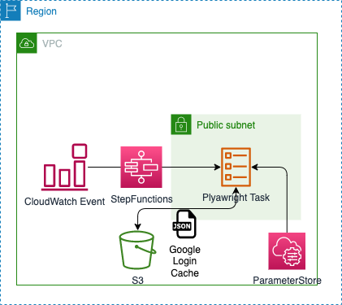

# Hoyo-Login

**ja**  
このプロジェクトでは、原神のログインボーナスを自動的に受け取り、LINE通知で受け取った結果を通知するアプリケーションを構築しています。アプリケーションはPlaywrightを使用し、インフラ環境はAWS CDKを使用して構築されています。
クロスプラットフォームです(たぶん)。Windows、Linux、macOSで、ローカル

Google認証でホヨラボにログインできる場合のみ利用できます。
目安月コスト$0.5

**en**  
This project involves building an application that automatically receives HaraShin login bonuses and notifies users of the results received via LINE notifications. The application is built using Playwright and the infrastructure environment is built using AWS CDK.
maybe Cross-platform. Windows, Linux, and macOS, locally 

Available only if you can log in to HoyoLab with Google Authentication.
Approximate monthly cost $0.5

